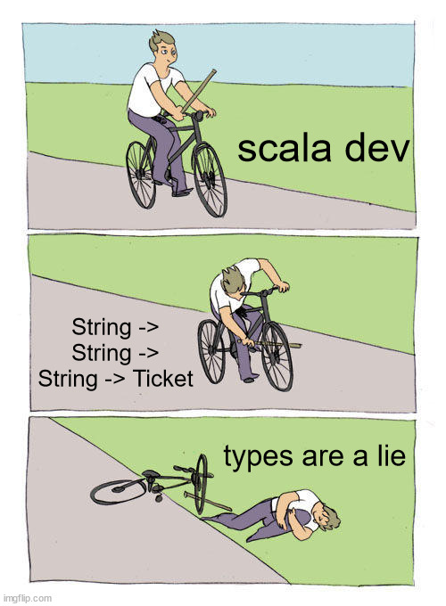

### types are a lie
on crée un titre, easy right ?

```scala mdoc
case class Ticket(pnr: String, tcn: String, fareCode: String)

val ticket = Ticket(pnr = "UEMZTN", tcn = "459036690", fareCode = "AE98")
```

on peut écrire aussi :cold_sweat:

```scala mdoc
val emptyTicket = Ticket(pnr = "", tcn = "", fareCode = "")
```
donc on peut dire 


### value types à la rescousse

```scala mdoc:reset-object

case class PnrV(value: String) extends AnyVal
case class TcnV(value: String) extends AnyVal
case class FareCodeV(value: String) extends AnyVal

case class TicketV(pnr: PnrV, tcn: TcnV, fareCode: FareCodeV)

val ticketV = TicketV(pnr = PnrV("UEMZTN"), tcn = TcnV("459036690"), fareCode = FareCodeV("AE98"))
```

mais on peut aussi écrire :thinking: 
```scala mdoc
val emptyTicketV = TicketV(pnr = PnrV(""), tcn = TcnV(""), fareCode = FareCodeV(""))
```

### smart constructor ftw ?
```scala mdoc:reset-object
import cats.implicits._

case class PnrSmart private(value: String) extends AnyVal

object PnrSmart {
    def mkPnr(value: String): Option[PnrSmart] = 
        if(value.nonEmpty) Some(PnrSmart(value)) else None
}

case class TcnSmart private(value: String) extends AnyVal

object TcnSmart {
    def mkTcn(value: String): Option[TcnSmart] = 
        if(value.nonEmpty) Some(TcnSmart(value)) else None
}

case class FareCodeSmart private(value: String) extends AnyVal

object FareCodeSmart {
    def mkFareCode(value: String): Option[FareCodeSmart] = 
        if(value.nonEmpty) Some(FareCodeSmart(value)) else None
}

case class TicketSmart(pnr: PnrSmart, tcn: TcnSmart, fareCode: FareCodeSmart)

(
    PnrSmart.mkPnr("UEMZTN"),
    TcnSmart.mkTcn("459036690"),
    FareCodeSmart.mkFareCode("AE98") 
).mapN {
    case (pnr, tcn, fareCode) => 
        TicketSmart(pnr = pnr, tcn = tcn, fareCode = fareCode)
}

```
beaucoup de code, but still on peut etre crado :confused:

```scala mdoc
(
    PnrSmart.mkPnr("UEMZTN"),
    TcnSmart.mkTcn("459036690"),
    FareCodeSmart.mkFareCode("AE98") 
).mapN {
    case (pnr, tcn, fareCode) => 
        TicketSmart(pnr = pnr.copy(value = ""), tcn = tcn, fareCode = fareCode)
}
```
On peut toujours essayer de bloquer cette méthode `copy` qui vient par défaut avec les `case class` en utilisant les `sealed abstract case class` :wink: 4 mots clés qui dit plus
```scala mdoc
sealed abstract class PnrStrong (val value: String) 

object PnrStrong {
    def mkPnrStrong(value: String): Option[PnrStrong] = 
        (value.nonEmpty).guard[Option].as(new PnrStrong(value){}) 
}

```
:scream::scream: quelle horreur ce code, beaucoup de boilerplate et on perd l'optimisation de l'allocation mémoire ! wouhou :sob: !

### new era, newtypes

En utilisant les `value classes`, scala ne nous garantit pas à 100% l'optimisation de l'allocation mémoire, et il existe des cas ou scala explicitement ne fait pas cette optimisation:

- lorsque la `value class` est assigné à un `array`
- quand on fait des `runtime type tests`, comme le fameux `pattern matching`

pour garder un code facile à lire, optimisé, ma recommendation est d'utiliser la librairie [Newtype](https://github.com/estatico/scala-newtype)

`Newtype` garantit `zero cost wrappers WITH NO RUNTIME OVERHEAD` et enlève la méthode `copy` :tada:

```scala mdoc
import io.estatico.newtype.macros._

@newtype case class Tcn(value: String)

@newtype  case class Pnr(value: String)

@newtype case class FareCode(value: String)

```

tout a l'air bon, sauf qu'on peut toujours écrire 

```scala mdoc
val tcn = Tcn("")

```
 📝 Newtypes résout uniquement le problème de zero-cost wrappers, mais ne résout pas le problème de la validation 