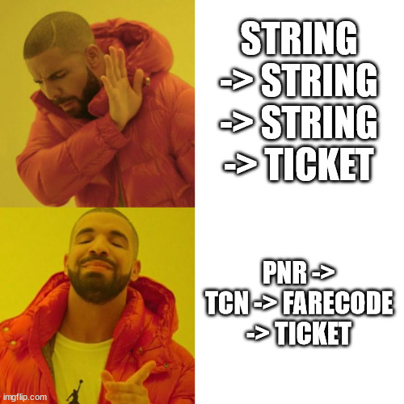

### types are a lie
on crée un titre, easy right ?

```scala
case class TicketS(pnr: String, tcn: String, fareCode: String)

val ticketS = TicketS(pnr = "UEMZTN", tcn = "459036690", fareCode = "AE98")
// ticketS: TicketS = TicketS(
//   pnr = "UEMZTN",
//   tcn = "459036690",
//   fareCode = "AE98"
// )
```

on peut écrire aussi :cold_sweat:

```scala
val emptyTicket = TicketS(pnr = "", tcn = "", fareCode = "")
// emptyTicket: TicketS = TicketS(pnr = "", tcn = "", fareCode = "")
```
donc on peut dire 


### value types à la rescousse

```scala
case class PnrV(value: String) extends AnyVal
case class TcnV(value: String) extends AnyVal
case class FareCodeV(value: String) extends AnyVal

case class TicketV(pnr: PnrV, tcn: TcnV, fareCode: FareCodeV)

val ticketV = TicketV(pnr = PnrV("UEMZTN"), tcn = TcnV("459036690"), fareCode = FareCodeV("AE98"))
// ticketV: TicketV = TicketV(
//   pnr = PnrV(value = "UEMZTN"),
//   tcn = TcnV(value = "459036690"),
//   fareCode = FareCodeV(value = "AE98")
// )
```

mais on peut aussi écrire :thinking: 
```scala
val emptyTicketV = TicketV(pnr = PnrV(""), tcn = TcnV(""), fareCode = FareCodeV(""))
// emptyTicketV: TicketV = TicketV(
//   pnr = PnrV(value = ""),
//   tcn = TcnV(value = ""),
//   fareCode = FareCodeV(value = "")
// )
```

### smart constructor ftw ?
```scala
import cats.implicits._

case class PnrSmart private(value: String) extends AnyVal

object PnrSmart {
    def mkPnr(value: String): Option[PnrSmart] = 
        if(value.nonEmpty) Some(PnrSmart(value)) else None
}

case class TcnSmart private(value: String) extends AnyVal

object TcnSmart {
    def mkTcn(value: String): Option[TcnSmart] = 
        if(value.nonEmpty) Some(TcnSmart(value)) else None
}

case class FareCodeSmart private(value: String) extends AnyVal

object FareCodeSmart {
    def mkFareCode(value: String): Option[FareCodeSmart] = 
        if(value.nonEmpty) Some(FareCodeSmart(value)) else None
}

case class TicketSmart(pnr: PnrSmart, tcn: TcnSmart, fareCode: FareCodeSmart)

(
    PnrSmart.mkPnr("UEMZTN"),
    TcnSmart.mkTcn("459036690"),
    FareCodeSmart.mkFareCode("AE98") 
).mapN {
    case (pnr, tcn, fareCode) => 
        TicketSmart(pnr = pnr, tcn = tcn, fareCode = fareCode)
}
// res2: Option[TicketSmart] = Some(
//   value = TicketSmart(
//     pnr = PnrSmart(value = "UEMZTN"),
//     tcn = TcnSmart(value = "459036690"),
//     fareCode = FareCodeSmart(value = "AE98")
//   )
// )
```
beaucoup de code, but still on peut etre crado :confused:

```scala
(
    PnrSmart.mkPnr("UEMZTN"),
    TcnSmart.mkTcn("459036690"),
    FareCodeSmart.mkFareCode("AE98") 
).mapN {
    case (pnr, tcn, fareCode) => 
        TicketSmart(pnr = pnr.copy(value = ""), tcn = tcn, fareCode = fareCode)
}
// res3: Option[TicketSmart] = Some(
//   value = TicketSmart(
//     pnr = PnrSmart(value = ""),
//     tcn = TcnSmart(value = "459036690"),
//     fareCode = FareCodeSmart(value = "AE98")
//   )
// )
```
On peut toujours essayer de bloquer cette méthode `copy` qui vient par défaut avec les `case class` en utilisant les `sealed abstract case class` :wink: 4 mots clés qui dit plus
```scala
sealed abstract class PnrStrong (val value: String)  

object PnrStrong {
    def mkPnrStrong(value: String): Option[PnrStrong] = 
        (value.nonEmpty).guard[Option].as(new PnrStrong(value){}) 
}
```
:scream::scream: quelle horreur ce code, beaucoup de boilerplate et on perd l'optimisation de l'allocation mémoire ! wouhou :sob: !

### new era, newtypes

En utilisant les `value classes`, scala ne nous garantit pas à 100% l'optimisation de l'allocation mémoire, et il existe des cas ou scala explicitement ne fait pas cette optimisation:

- lorsque la `value class` est assigné à un `array`
- quand on fait des `runtime type tests`, comme le fameux `pattern matching`

pour garder un code facile à lire, optimisé, ma recommendation est d'utiliser la librairie [Newtype](https://github.com/estatico/scala-newtype)

`Newtype` garantit `zero cost wrappers WITH NO RUNTIME OVERHEAD` et enlève la méthode `copy` :tada:

```scala
import io.estatico.newtype.macros._

@newtype case class TcnN(value: String)

@newtype  case class PnrN(value: String)

@newtype case class FareCodeN(value: String)
```

tout a l'air bon, sauf qu'on peut toujours écrire 

```scala
val tcnN = TcnN("")
// tcnN: TcnN = ""
```
 📝 Newtypes résout uniquement le problème de zero-cost wrappers, mais ne résout pas le problème de la validation 

 ### let's refine all this
 La librairie [refined](https://github.com/fthomas/refined) nous permet de valider les données au compile time et au runtime time.

```scala
import eu.timepit.refined.types.string._
import eu.timepit.refined.auto._

@newtype case class TcnRefined(value: NonEmptyString)

val tcnRefined = TcnRefined("123456")
// tcnRefined: TcnRefined = 123456
```
refined semble etre une bonne piste, elle s'intègre parfaitement avec `Circe`, `Scalacheck`, `PureConfig` et beaucoup d'autres librairies de l'ecosystème scala.

#### runtime validation
le premier exemple a montré la capacité de faire de la validation au compile time et la combinaison avec les newtypes.
Dans cette partie nous allons explorer la validation au runtime, des données qu'on recoit par exemple d'une requete HTTP ou autre service ou la compile validation n'est pas possible.

Refined propose une fonction générique, qui est définit comme suit:
```scala
def refineV[P]: RefinePartiallyApplied[P] = new RefinePartiallyApplied[P]

// Note le P == Predicate

final class RefinePartiallyApplied[P] {
    def apply[T](t: T)(implicit v: Validate[T, P]): Either[String, Refined[T, P]]
}
```
dans le prochain exemple, supposons que `str` est une runtime value.

```scala
import eu.timepit.refined.api.Refined
import eu.timepit.refined._  
import eu.timepit.refined.auto._
import eu.timepit.refined.api.RefinedTypeOps
import eu.timepit.refined.numeric.Greater

val str: String = "some runtime value"
// str: String = "some runtime value"

val res: Either[String, NonEmptyString] = NonEmptyString.from(str)
// res: Either[String, NonEmptyString] = Right(value = some runtime value)

val emptyStr: String = ""
// emptyStr: String = ""

val resEmpty: Either[String, NonEmptyString] = NonEmptyString.from(emptyStr)
// resEmpty: Either[String, NonEmptyString] = Left(
//   value = "Predicate isEmpty() did not fail."
// )

// on peut faire aussi 
type GTFive = Int Refined Greater[5] // je définis un nouveau type // je définis un nouveau type

object GTFive extends RefinedTypeOps[GTFive, Int] // je définis l'objet et je l'enrichis avec les fonctions de RefinedType // je définis l'objet et je l'enrichis avec les fonctions de RefinedType

val number: Int = 33
// number: Int = 33

val gtFiveRes: Either[String, GTFive] = GTFive.from(number) // je bénificie de la fonction `from`
// gtFiveRes: Either[String, GTFive] = Right(value = 33)
```

on remarque que la validation au runtime se fait en utilisant des `Either`, qui est une `Monad`, ec qui veut dire que la validation se fait séquentiellement, ca échoue à la première erreur. L'utilisation de `cats.data.Validated` qui ressemble beaucoup à `Either` sinon le fait que c'est une `Applicative` capable de cumuler les erreurs et valider la data en parallèle.
Le type qu'on utilise assez souvent `ValidatedNel[E,A]` qui est un alias de `Validated[NonEmptyString[E], A]`

```scala
import cats.implicits._
import cats.data.ValidatedNel

case class MyType(a: NonEmptyString, b: GTFive)

def validate(a: String, b: Int): ValidatedNel[String, MyType] =
    (   
        NonEmptyString.from(a).toValidatedNel,
        GTFive.from(b).toValidatedNel
    ).mapN(MyType.apply)


val expectValidationError = validate("", 3)    
// expectValidationError: ValidatedNel[String, MyType] = Invalid(
//   e = NonEmptyList(
//     head = "Predicate isEmpty() did not fail.",
//     tail = List("Predicate failed: (3 > 5).")
//   )
// )
```
revenons à notre exemple de `Ticket`
```scala
type PnrR = NonEmptyString
object PnrR extends RefinedTypeOps[PnrR, String]

type TcnR = NonEmptyString
object TcnR extends RefinedTypeOps[TcnR, String]

type FareCodeR = NonEmptyString
object FareCodeR extends RefinedTypeOps[FareCodeR, String]

@newtype case class Tcn(value: TcnR)
@newtype case class Pnr(value: PnrR)
@newtype case class FareCode(value: FareCodeR)

case class Ticket(pnr: Pnr, tcn: Tcn, fareCode: FareCode)

def mkTicket(t: String, p: String, fc: String): ValidatedNel[String, Ticket] = 
    (
        PnrR.from(p).toValidatedNel.map(Pnr.apply),
        TcnR.from(t).toValidatedNel.map(Tcn.apply),
        FareCodeR.from(fc).toValidatedNel.map(FareCode.apply)
    ).mapN(Ticket.apply)
```

ouf :sweat_smile: ca fait le job mais beaucoup de boilerplate, mais on remarque l'émergence d'un pattern.
Idéalement on voudrait arriver à écrire

```scala
def mkTicket(t: String, p: String, fc: String): ValidatedNel[String, Ticket] = 
    (
        validate[Pnr](p),
        validate[Tcn](t),
        validate[FareCode](fc)
    ).mapN(Ticket.apply)  
```
let's do it

```scala
object NewtypeRefinedOps {
    import io.estatico.newtype.Coercible
    import io.estatico.newtype.ops._
    import eu.timepit.refined._
    import eu.timepit.refined.api._
    import eu.timepit.refined.auto._

    
    final class NewtypeRefinedPartiallyApplied[A] {
        def apply[T, P](raw: T)(implicit c: Coercible[Refined[T, P], A], v: Validate[T, P]): ValidatedNel[String, A] =
        refineV[P](raw).toValidatedNel.map(_.coerce[A])
    }
    
    def validate[A]: NewtypeRefinedPartiallyApplied[A] =
        new NewtypeRefinedPartiallyApplied[A]

    implicit class NewtypeOps[T](raw: T) {
    def as[A]: NewtypePartiallyApplied[A, T] = new NewtypePartiallyApplied[A, T](raw)
  }

  final class NewtypePartiallyApplied[A, T](raw: T) {
    def validate[P](implicit
        c: Coercible[Refined[T, P], A],
        v: Validate[T, P]
    ): ValidatedNel[String, A] =
      refineV[P](raw).toValidatedNel.map(_.coerce[A])
  }

}
```

and now ... on peut écrire avec le sourire


```scala
import NewtypeRefinedOps._

def mkTicket2(t: String, p: String, fc: String): ValidatedNel[String, Ticket] = 
    (
        p.as[Pnr].validate,
        t.as[Tcn].validate,
        fc.as[FareCode].validate
    ).mapN(Ticket.apply)    


val enfinErrorTicket = mkTicket2("pnr", "", "AE93")
// enfinErrorTicket: ValidatedNel[String, Ticket] = Invalid(
//   e = NonEmptyList(head = "Predicate isEmpty() did not fail.", tail = List())
// )

val enfinGoodTicket = mkTicket2("UEMZTN", "459036690", "AE98")
// enfinGoodTicket: ValidatedNel[String, Ticket] = Valid(
//   a = Ticket(pnr = 459036690, tcn = UEMZTN, fareCode = AE98)
// )
```
donc en fin de compte, les types ARE ALIIIIVE comme dirait Pierre.. \


### Intégration avec circe
on peut facilement intégrer les librairies `newtypes` et `refined` avec `circe` et utiliser le `typeclass derivation` afin de génèrer les decoders/encoders.
on peut utiliser la librairie [derevo](https://github.com/tofu-tf/derevo) pour le `typeclass derivation`
.. dig further